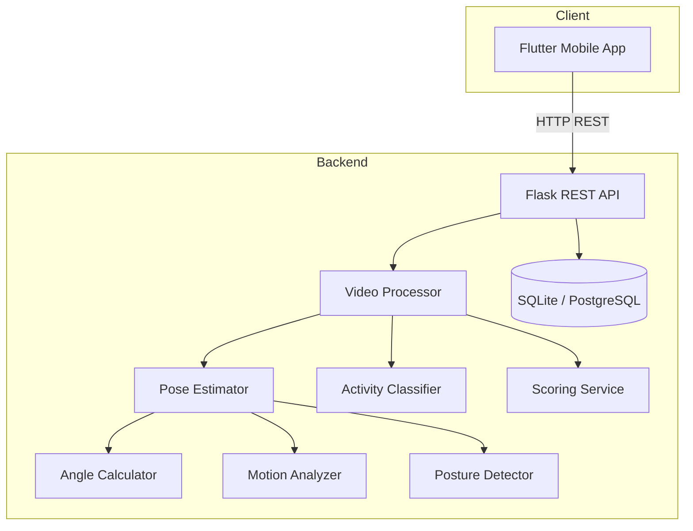

# System Design — Motor Function Tracker

## 1. High-Level Architecture



## 2. Component Responsibilities

### 2.1 Flask API (`backend/app.py`)

- Application factory pattern
- CORS enabled for mobile clients
- Blueprint-based routing (`analyze`, `sessions`)
- Global error handlers for consistent JSON errors

### 2.2 Pose Estimation (`services/pose_estimator.py`)

- **Primary:** MediaPipe Pose (33 landmarks)
- **Extensible:** MoveNet/YOLO stubs via factory pattern
- Skeleton overlay drawing on frames

### 2.3 Angle Calculator (`services/angle_calculator.py`)

Computes joint angles using the dot product formula at each joint vertex:

```
angle = arccos((BA · BC) / (|BA| × |BC|))
```

### 2.4 Motion Analyzer (`services/motion_analyzer.py`)

- **Speed:** Hip center displacement / Δt
- **Repetitions:** Peak-valley detection on knee angle (squat pattern)
- **ROM:** Running min/max per joint

### 2.5 Posture Detector (`services/posture_detector.py`)

Checks:
- Shoulder level asymmetry
- Lateral spine alignment
- Knee hyperextension / excessive flexion
- Hip angle asymmetry
- Deviation from neutral reference angles

### 2.6 Activity Classifier (`services/activity_classifier.py`)

Rule-based classification using ROM and speed:
- `standing`, `walking`, `squatting`, `arm_raise`, `general_exercise`

### 2.7 Scoring Service (`services/scoring_service.py`)

Motor function score (0–100) weighted components:

| Component | Weight |
|-----------|--------|
| Posture   | 35%    |
| ROM       | 25%    |
| Symmetry  | 25%    |
| Movement  | 15%    |

Deviation penalty: up to −30 points.

## 3. Data Flow

### Video Analysis

```
1. Client uploads video (multipart)
2. API saves to uploads/
3. VideoProcessor opens capture, samples every N frames
4. Per frame: detect pose → angles → motion → posture
5. Aggregate metrics across frames
6. Classify activity, compute motor function score
7. Persist AnalysisSession + FrameMetric rows
8. Return JSON + session_id
```

### Frame Analysis

```
1. Client sends image (file or base64)
2. Single-frame pipeline
3. Return overlay image + metrics
4. Persist as single-frame session
```

## 4. Database Schema

### analysis_sessions

| Column | Type | Description |
|--------|------|-------------|
| id | INTEGER PK | Auto-increment |
| created_at | TIMESTAMP | Session start |
| source_type | VARCHAR | video / frame |
| joint_angles_avg | TEXT (JSON) | Average angles |
| range_of_motion | TEXT (JSON) | ROM per joint |
| repetition_count | INTEGER | Total reps |
| posture_score | FLOAT | 0–100 |
| motor_function_score | FLOAT | 0–100 |
| posture_deviations | TEXT (JSON) | Detected issues |
| summary | TEXT (JSON) | Session summary |

### frame_metrics

| Column | Type | Description |
|--------|------|-------------|
| id | INTEGER PK | |
| session_id | FK | Parent session |
| frame_index | INTEGER | Frame number |
| shoulder_angle_left | FLOAT | Per-joint angles |
| ... | FLOAT | (10 angle columns) |
| movement_speed | FLOAT | px/s |
| posture_score | FLOAT | Frame score |
| landmarks | TEXT (JSON) | Optional landmark data |

See `backend/database/schema.sql` for full DDL.

## 5. Flutter App Structure

```
lib/
├── main.dart              # App entry + bottom nav shell
├── models/                # AnalysisSession, JointAngles
├── services/              # ApiService (HTTP client)
├── screens/
│   ├── dashboard_screen   # Overview + quick actions
│   ├── upload_screen      # Camera/gallery picker
│   ├── analysis_screen    # Results + charts
│   ├── history_screen     # Past sessions
│   └── report_screen      # Detailed report
├── widgets/               # Charts, metric cards, score rings
└── theme/                 # AppTheme colors
```

## 6. Security Considerations

- Max upload size: 100MB
- File type validation on upload
- Use `SECRET_KEY` env var in production
- CORS currently open (`*`) — restrict in production
- No authentication in v1 — add JWT/OAuth for multi-user deployments

## 7. Scalability

| Bottleneck | Mitigation |
|------------|------------|
| Video processing CPU | Sample frames (VIDEO_SAMPLE_RATE), async job queue |
| Concurrent requests | Gunicorn workers, Celery task queue |
| Storage growth | Archive old sessions, S3 for uploads |
| Real-time streaming | WebSocket + frame-by-frame endpoint |

## 8. Future Enhancements

- TensorFlow/PyTorch activity classification model
- Real-time WebSocket streaming from mobile camera
- Multi-person pose tracking (YOLO-Pose)
- Clinician portal web dashboard
- Export PDF reports
- FHIR integration for clinical workflows

## 9. Deployment

### Development

```bash
python -m backend.app
```

### Production

```bash
gunicorn -w 4 -b 0.0.0.0:5000 "backend.app:app"
```

Environment variables:
- `DATABASE_URL` — PostgreSQL connection string
- `SECRET_KEY` — Flask secret
- `POSE_MODEL` — mediapipe | movenet | yolo
